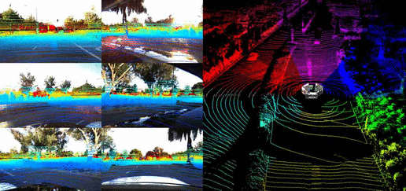

# DDAD - Dense Depth for Autonomous Driving

<a href="https://www.tri.global/" target="_blank">
 
</a>

- [How to Use](#how-to-use)
- [Dataset details](#dataset-details)
- [Dataset stats](#dataset-stats)
- [References](#references)
- [Privacy](#privacy)
- [License](#license)

DDAD is a new autonomous driving benchmark from TRI (Toyota Research Institute) for long range (up to 250m) and dense depth estimation in challenging and diverse urban conditions. It contains monocular videos and accurate ground-truth depth (across a full 360 degree field of view) generated from high-density LiDARs mounted on a fleet of self-driving cars operating in a cross-continental setting. DDAD contains scenes from urban settings in the United States (San Francisco, Bay Area, Cambridge, Detroit, Ann Arbor) and Japan (Tokyo, Odaiba).



## How to Use

The data can be downloaded here: [train+val](https://tri-ml-public.s3.amazonaws.com/github/DDAD/datasets/DDAD.tar) (257 GB, md5 checksum: `027686329dda41bd540e71ac5b43ebcb`) and [test](coming_soon). To load the dataset, please use the [TRI Dataset Governance Policy (DGP) codebase](https://github.com/TRI-ML/dgp). The following snippet will instantiate the dataset:

```python
from dgp.datasets import SynchronizedSceneDataset

# Load synchronized pairs of camera and lidar frames.
dataset =
SynchronizedSceneDataset('<path_to_dataset>/ddad.json',
    datum_names=('lidar', 'camera_01', 'camera_05'),
    generate_depth_from_datum='lidar',
    split='train'
    )

# Iterate through the dataset.
for sample in dataset:
  # Each sample contains a list of the requested datums.
  lidar, camera_01, camera_05 = sample[0:3]
  point_cloud = lidar['point_cloud'] # Nx3 numpy.ndarray
  image_01 = camera_01['rgb']  # PIL.Image
  depth_01 = camera_01['depth'] # (H,W) numpy.ndarray, generated from 'lidar'
```


The [DGP](https://github.com/TRI-ML/dgp) codebase provides a number of functions that allow loading one or multiple camera images, projecting the lidar point cloud into the camera images, intrinsics and extrinsics support, etc. Additionally, please refer to the [Packnet-SfM](https://github.com/TRI-ML/packnet-sfm) codebase (in PyTorch) for more details on how to integrate and use DDAD for depth estimation training/inference/evaluation and state-of-the-art pretrained models.

## Dataset details

DDAD includes high-resolution, long-range [Luminar-H2](https://www.luminartech.com/technology) as the LiDAR sensors used to generate pointclouds, with a maximum range of 250m and sub-1cm range precision. Additionally, it contains six calibrated cameras time-synchronized at 10 Hz, that together produce a 360 degree coverage around the vehicle. The six cameras are 2.4MP (1936 x 1216), global-shutter, and oriented at 60 degree intervals. They are synchronized with 10 Hz scans from our Luminar-H2 sensors oriented at 90 degree intervals (datum names: `camera_01`, `camera_05`, `camera_06`, `camera_07`, `camera_08` and `camera_09`) - the camera intrinsics can be accessed with `datum['intrinsics']`. The data from the Luminar sensors is aggregated into a 360 point cloud covering the scene (datum name: `lidar`). Each sensor has associated extrinsics mapping it to a common vehicle frame of reference (`datum['extrinsics']`).

The training and validation scenes are 5 or 10 seconds long and consist of 50 or 100 samples with corresponding Luminar-H2 pointcloud and six image frames including intrinsic and extrinsic calibration. The training set contains 150 scenes with a total of 12650 individual samples (75900 RGB images), and the validation set contains 50 scenes with a total of 3950 samples (23700 RGB images).

The test set contains 235 scenes, each 1.1 seconds long and consisting of 11 frames, for a total of 2585 frames (15510 RGB images). The middle frame of each scene has associated panoptic segmentation labels (i.e. semantic and instance segmentation) that **will not be made public**, but will be used to compute finer gained depth metrics (per semantic class and per instance) on an evaluation server (coming soon).

<p float="left">
  
  
  
</p>


## Dataset stats

### Training split

| Location      | Num Scenes (50 frames)     |  Num Scenes (100 frames)  | Total frames |
| ------------- |:-------------:|:-------------:|:-------------:|
| SF            | 0  |  19 | 1900 |
| ANN           | 23  | 53 | 6450 |
| DET           |  8  | 0  | 400 |
| Japan         | 16  | 31  | 3900 |

Total: `150 scenes` and `12650 frames`.

### Validation split

| Location      | Num Scenes (50 frames)     |  Num Scenes (100 frames)  | Total frames |
| ------------- |:-------------:|:-------------:|:-------------:|
| SF            | 1  |  10 | 1050 |
| ANN           | 11  | 14 | 1950 |
| Japan         | 9  | 5  | 950 |

Total: `50 scenes` and `3950 frames`.


### Validation split

| Location      | Num Scenes (11 frames)      | Total frames |
| ------------- |:-------------:|:-------------:|
| SF            | 69  | 759  |
| ANN           | 49  | 539  |
| CAM           | 61  | 671  |
| Japan         | 56  | 616  |

Total: `235 scenes` and `2585 frames`.

USA locations: ANN - Ann Arbor, MI; SF - San Francisco Bay Area, CA; DET - Detroit, MI; CAM - Cambridge, Massachusetts. Japan locations: Tokyo and Odaiba.


## References

Please use the following citation when referencing DDAD:

#### 3D Packing for Self-Supervised Monocular Depth Estimation (CVPR 2020 oral)
*Vitor Guizilini, Rares Ambrus, Sudeep Pillai, Allan Raventos and Adrien Gaidon*, [**[paper]**](https://arxiv.org/abs/1905.02693), [**[video]**](https://www.youtube.com/watch?v=b62iDkLgGSI)
```
@inproceedings{packnet,
  author = {Vitor Guizilini and Rares Ambrus and Sudeep Pillai and Allan Raventos and Adrien Gaidon},
  title = {3D Packing for Self-Supervised Monocular Depth Estimation},
  booktitle = {IEEE Conference on Computer Vision and Pattern Recognition (CVPR)},
  primaryClass = {cs.CV}
  year = {2020},
}
```

## Privacy

To ensure privacy the DDAD dataset has been anonymized (license plate and face blurring) using state-of-the-art object detectors.


## License

<a rel="license" href="http://creativecommons.org/licenses/by-nc-sa/4.0/"></a><br />This work is licensed under a <a rel="license" href="http://creativecommons.org/licenses/by-nc-sa/4.0/">Creative Commons Attribution-NonCommercial-ShareAlike 4.0 International License</a>.
